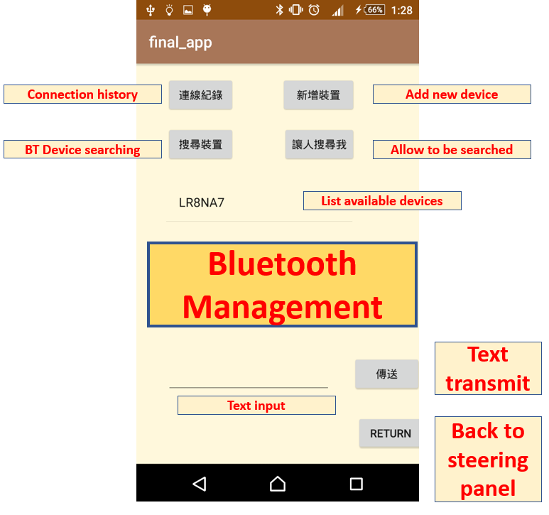

# Bluetooth Steering Wheel Remote Control Car App

This is an Android App project that attempts to simulate real car driving and synchronize passing real-time streaming data to another device like Arduino through Bluetooth.   

----

## Tool

This project utilize tools include Android studio and Arduino. 

## Concepts

* Socket network
* Handling sensor data in phone: Accelerometer 
* Bluetooth data transmission
* I2C communication
* LCD display

## System Architecture

The system architecture is majorly composed of transmitting and receiving parts. The phone app is responsible for managing the   BlueTooth device, getting and handling sensor data, and data transmitting tasks; whereas, the Arduino device is responsible for receiving data from the phone app.

* Features of **Arduino**:

1. For **Testing mode**, purely receive text messages and show them on the LCD screen.

2. For **Car Steering mode**, receive text messages and process them into two variables: speed and angle, 

   then display them on LCD.

3. If there is no message received for a period of time. It will make the Arduino changes to the **standby state**.

   

* Features of **Android App**:

1. Searching and managing Bluetooth devices.

2. Grab accelerometer information and handling.

3. Transmit messages to the Bluetooth device.

4. Once the phone screen exits, it will automatically log off the accelerometer to prevent power consumption.

5. Switching pages or first connecting to Arduino might cause the unstable changing mode for Arduino. 

   In the case of need, We design an auxiliary button, which can help the state not to be messed up.

## Interfaces of App

